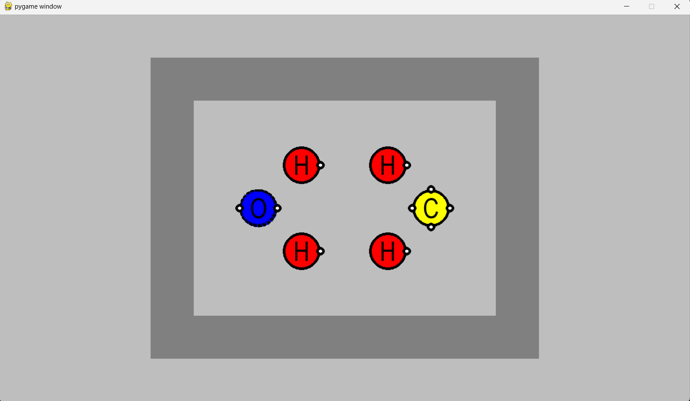

# Sokobond - Artificial Intelligence Implementation

Main menu:


Level menu:


Game:



Ai menu:


Heuristic menu:


## Table of Contents

- [Setup](#setup)
- [Usage](#usage)
- [Files](#files)
    - [main.py](#mainpy)
    - [levels.py](#levelspy)
    - [model.py](#modelpy)
    - [view.py](#viewpy)
    - [controller.py](#controllerpy)
    - [algorithms.py](#algorithmspy)
        - [TreeNodes](#treenodes)
        - [MutualFunction](#mutualfunction)
        - [DFS](#dfs)
        - [BFS](#bfs)
        - [GREEDY](#greedy)
        - [ASTAR](#astar)


---

## Setup

We used Python 3 to run the application.
It was used [Pygame](https://www.pygame.org/news) to display the application.
You can install it manually with the following command:
```bash
pip install pygame
```

## Usage

In order to run the application, please run the `main.py` file inside the `src` folder on your IDE, or with the following command:
```bash
python3 src/main.py
# or
python src/main.py
```

## Files
The application was built based on MVC architecture, with the following files, which provide  a better understanding of the code structure and organization as well as the game logic.

### main\.py
This file is our starting point. It contains the main loop that maintains the programme in which all the events triggered by the keys pressed by the user are processed and their repercussions drawn on the screen.

```python
while running: 
    ...

     for event in pygame.event.get():
            if event.type == pygame.QUIT:
                running = False
            if event.type == pygame.KEYDOWN:

    ...

     view.display(...)

     ...
```


### levels\.py
This file contains a subset of the total set of levels that the original game offers, based on an attempt to cover as much variety as possible.
Each level is saved with its board representation, the position of the pivot piece (_player_pos_) and, if available, the location of the special pieces that allow you to cut connections between the atmos (_cut_pieces_).
```python
LEVELS = {
    1: {"board" : [
    ['y', 'y', 'y', 'y', 'y', 'y'],
    ['y', 'H', None, None, 'O', 'y'],
    ['y', None, None, None, None, 'y'],
    ['y', None, 'H', 'y', 'y', 'y'],
    ['y', 'y', 'y', 'y', None, None]],
    "player_pos" : (1,1),
    "cut_pieces" : []
    },
    ...
}
```


### model\.py
This file contains the skeleton of all the entities designed for the development of this game, including all the parameters and inherent functions relevant to their function during execution.

#### Piece
```python
class Piece:
    def __init__(self, atom, position, avElectrons):
            self.atom = atom
            self.position = position
            self.avElectrons = avElectrons
            self.connections = []
            self.visited = False
```

#### Arena
This class represents the levels defined in the **levels\.py** file, storing all the information for each level at the moment.
```python
class Arena:
    def __init__(self, level):
        self.board = level["board"]
        self.player_pos = level["player_pos"]
        self.walls = self.listWalls()
        self.cut_pieces = level["cut_pieces"]
```

#### Game
```python
class Game:
    def __init__(self, arena: Arena):
        self.arena = arena
        self.pieces = self.listPieces()
        self.Connections()
```

#### GameState
This classe is used to store the current state of the game, including the pieces and the arena.
```python
class GameState:
    def __init__(self, pieces, arena):
        self.pieces = pieces
        self.arena = arena
```

#### TreeNode
This class is used to store the state of the game in a tree structure, with the parent node and the children nodes, helping ilustrate the search tree for the algorithms.
```python
class TreeNode:
    def __init__(self, state, prev_move=None, parent=None, heuristicVal=0):
        self.state = state
        self.prev_move = prev_move
        self.parent = parent
        self.heuristicVal = heuristicVal
        self.treeDepth()
        self.children = []
```


### view\.py
This file contains everything related to the interface presented to the user. It contains constant and necessary visual information, as well as the main function _display()_ which, depending on the state of the programme, calls the corresponding functions.
```python
#Colors
white = (255, 255, 255)
red = (255, 0, 0)
green = (0, 255, 0)
blue = (0, 0, 255)
yellow = (255, 255, 0)
grey = (128,128,128)
black = (0,0,0)

#Dimensions
SQUARE_SIZE = 80
PIECE_SIZE = 35
CUT_PIECE_SIZE = 8
ELECTRON_SIZE = 8

# Board colors
COLORS = {
    'H': red,
    'N': green,
    'O': blue,
    'C': yellow,
    'y': yellow,
    'g': grey,
    None: white
} 

# Global variables
screen = None
game_name = "SOKOBOND"
game_name_font = None
menu_options_font = None
symbol_font = None

...

def display(...):
    screen.fill("grey")
    
    if not game_started and not level_menu and not menu_ia and not algorithm_menu: 
        drawMenu(menu_options, menu_option_selected)
    elif level_menu:
        drawMenuLevels(level_option, level_option_selected)
    elif menu_ia:
        drawMenuIA(menu_ia_options, menu_ia_selected)
    elif algorithm_menu:
        drawoptionsIA(algorithm_options, algorithm_selected)
    elif game_started:
        drawGame(game)

    if about:
        drawAbout()

    pygame.display.flip()

    ...
```

### controller\.py

```python
# Functions that verifies if the move is possible
    def validateMove(pieces, direction, arena):
        pivot = pieces[0]
        algorythms.initSearch(pieces)
        pieces[0].visited = True
        return checkMovePiece(pivot, pieces, direction, arena)
        
    def checkMovePiece(pivot, pieces, direction, arena):
        if(wallCollision(pivot, arena, direction)):
            return False
        for otherPiece in pieces:
            if (nearPieces(pivot, otherPiece) == direction and otherPiece not in pivot.connections):
                result = checkMovePiece(otherPiece, pieces, direction, arena)
                if result == False:
                    return False

        for connectedPiece in pivot.connections:
            if not connectedPiece.visited:
                if not checkDotCrossing(pivot, connectedPiece, direction, arena.cut_pieces):
                    connectedPiece.visited = True
                    result = checkMovePiece(connectedPiece, pieces, direction, arena)
                    if result == False:
                        return False

        return True

# Function that move the pieces
    def changeState(pieces, direction, arena):
    algorythms.initSearch(pieces)
    for piece in pieces:
        if not piece.visited:
            piece.visited = True
            cutConnections(piece, direction, arena)
    
    algorythms.initSearch(pieces)
    
    pivot = pieces[0]
    new_poss = [(pivot.position[0] + moves[direction][0], pivot.position[1] + moves[direction][1])]
    pivot.position = (pivot.position[0] + moves[direction][0], pivot.position[1] + moves[direction][1])
    pivot.visited = True
    moveAjacentPiece(pieces, direction, pivot, new_poss)
    
    newConnections(pieces)

    return pieces

# Function that verifies if the player won
    def endGame(pieces):
        algorythms.initSearch(pieces)
        algorythms.depth_search(pieces[0])
        for piece in pieces:
            if not piece.visited or piece.avElectrons > 0:
                return False
        return True
```
The _impossible_solution_ function was conceived and designed to help the implemented algorithms by cutting off the search of all branches from a certain state from which it is impossible to get a win/solution state.
```python
def impossible_solution(pieces, arena):
    if arena.cut_pieces:
        return False
    algorythms.initSearch(pieces)
    molecules = []
    for piece in pieces:
        if not piece.visited:
            electrons = algorythms.breadth_search(piece)
            molecules.append(electrons)
    for electrons in molecules:
        if electrons == 0 and len(molecules) > 1:
            return True
    return False
```

### algorithms\.py
This file contains the implementation of the functions corresponding to the algorithms chosen to be part of this project.
#### DFS
```python
def DFS(game: Game):
    visited = []
    root = TreeNode(GameState(game.pieces, game.arena))
    stack = [root]

    while stack:
        node = stack.pop()  
        node.treeDepth()
        if node.state.check_win():
            return node
        
        if node not in visited:
            visited.append(node)
            for state in node.state.childrenStates():
                leaf = TreeNode(state[1])
                leaf.prev_move = state[0]
                node.add_child(leaf)
                stack.append(leaf)
    return None

```

#### BFS
```python
def BFS(game: Game):
    visited = []
    root = TreeNode(GameState(game.pieces, game.arena))
    queue = deque([root])

    while queue:
        node = queue.popleft()  
        node.treeDepth()
        if node.state.check_win():
            return node
        
        if node not in visited:
            visited.append(node)
            for state in node.state.childrenStates():
                leaf = TreeNode(state[1])
                leaf.prev_move = state[0]
                node.add_child(leaf)
                queue.append(leaf)
    return None
```

#### Heuristic
In this project, we chose to use two different heuristics, both of which take advantage of the Manhattan distance.
The first depends solely and exclusively on this distance, prioritising the atoms that are closest to the molecule containing the pivot piece.
The second prioritises the distance between the molecule and the nearest atom with the greatest number of available electrons.
```python
def manhattanDistance(piece1, piece2):
    return abs(piece1.position[0] - piece2.position[0]) + abs(piece1.position[1] - piece2.position[1])

# This function will return the sum of minimum distance between the molecule and the nearst atom
def heuristic1(pieces):
    totalDistance = 0
    for index, piece in enumerate(pieces):
        if index == 0 or len(piece.connections) > 0:
            continue
        dist = manhattanDistance(pieces[0], piece)
        totalDistance += dist
    return totalDistance

# This function will return the sum of minimum distance between the molecule and the nearst atom with highest number of available electrons
def heuristic2(pieces):
    totalDistance = 0
    for index, piece in enumerate(pieces):
        if index == 0 or len(piece.connections) > 0:
            continue
        totalDistance += manhattanDistance(pieces[0], piece) * (piece.avElectrons + 1)
    return totalDistance
```

#### GREEDY
```python
def greedy_search(game: Game):
        root = TreeNode(GameState(game.pieces, game.arena))
        root.heuristicVal = heuristic(root.state.pieces)
        priorityQueue = [] 
        heappush(priorityQueue, (root.heuristicVal, root))
        filtered_states = []

        while priorityQueue:
            _, node = heappop(priorityQueue)
            node.treeDepth()
            if node.state.check_win():
                return node

            children = node.state.childrenStates()
            evaluated_children = [(heuristic(child[1].pieces), child) for child in children]

            for (value, child) in evaluated_children:
                if child in filtered_states:
                    continue
                
                filtered_states.append(child)

                child_tree = TreeNode(child[1])
                child_tree.prev_move = child[0]
                node.add_child(child_tree)
                
                child_tree.heuristicVal = value
                heappush(priorityQueue, (value, child_tree))

        return None
```

#### ASTAR
```python
def a_star_search(game: Game):
        root = TreeNode(GameState(game.pieces, game.arena))
        root.heuristicVal = heuristic(root.state.pieces)
        priorityQueue = [] 
        heappush(priorityQueue, (root.heuristicVal, root))
        filtered_states = []

        while priorityQueue:
            _, node = heappop(priorityQueue)
            node.treeDepth()
            if node.state.check_win():
                return node

            children = node.state.childrenStates()
            evaluated_children = [(heuristic(child[1].pieces) + node.depth, child) for child in children]

            for (value, child) in evaluated_children:
                if child in filtered_states:
                    continue
                
                filtered_states.append(child)

                child_tree = TreeNode(child[1])
                child_tree.prev_move = child[0]
                node.add_child(child_tree)
                
                child_tree.heuristicVal = value
                heappush(priorityQueue, (value, child_tree))

        return None

```
#### Depth Limited Search
```python
def depth_limited_search(game: Game, depth: int):
    visited = []
    root = TreeNode(GameState(game.pieces, game.arena))
    stack = [root]

    while stack:
        node = stack.pop()  
        node.treeDepth()
        if node.state.check_win():
            return node
        
        if node not in visited and node.depth < depth:
            visited.append(node)
            for state in node.state.childrenStates():
                leaf = TreeNode(state[1])
                leaf.prev_move = state[0]
                node.add_child(leaf)
                stack.append(leaf)
    return None
```
#### Iterative Deepening Search
```python
def iterative_deepening_search(game: Game):
    depth = 1
    while True:
        result = depth_limited_search(game, depth)
        if result:
            return result
        depth += 1
```
---

This project was made possible by:

| Name | Email |
|-|-|
| Francisco Campos | up202108735 |
| Henrique Pinheiro | up202108879 |
| Sara Azevedo | up202006902 |
